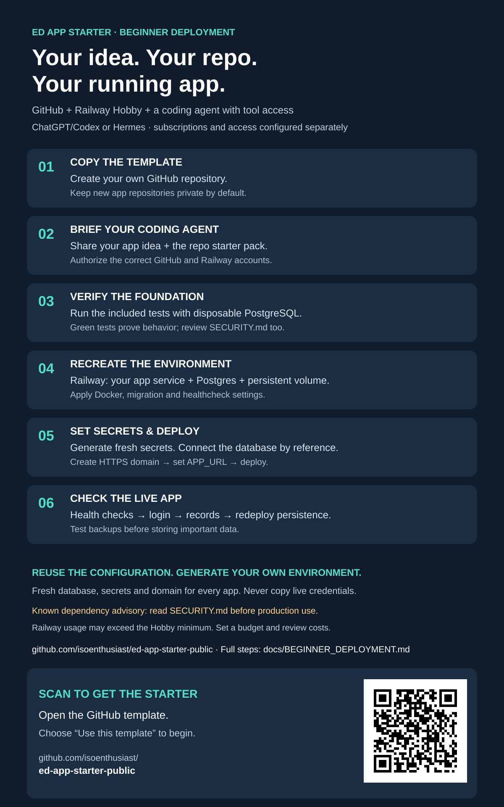

# From template to your first deployed app

Audience: beginners with a GitHub account, Railway Hobby account, and an AI coding agent such as ChatGPT/Codex or Hermes. ChatGPT Plus is a practical starting profile, not a universal minimum or a guarantee of connector access. Your agent needs repository files, a terminal and authorized deployment access to perform the steps; otherwise it should guide you through them.

This starter covers a web app using TypeScript, AdonisJS, PostgreSQL and HTMX. Android/Kotlin is an optional later phase, not included in this deployment.

## 1. Copy the template into your own GitHub account

Open https://github.com/isoenthusiast/ed-app-starter-public and choose **Use this template → Create a new repository**. Give your app a name; private is the recommended default for your new app. Your copy owns its code and future deployments. Do not deploy the shared starter repository as your editable application.

## 2. Give the coding agent the project brief

Open your new repository in your coding agent. Give it the prompt in AGENT_DEPLOYMENT_PROMPT.md plus your first useful workflow. Ask it to read APP_STARTER_PACK.md, AGENTS.md, SECURITY.md and RAILWAY_SETUP.md first. Connect GitHub and Railway using the agent's supported authorization flow. Confirm the actual account and workspace names; a connection labelled Primary is not identity proof.

A chat-only session can explain the steps but cannot claim to have run them. Never paste passwords, session cookies, database URLs or API keys into a chat or a public issue. Use supported sign-in and secret stores.

## 3. Verify the unchanged foundation

Have the agent run npm ci, starter:init and starter:verify against a disposable local PostgreSQL test database, or run the repository's Verify starter workflow in GitHub Actions. The workflow provisions its own temporary PostgreSQL service. A green result verifies the existing example; rerun after changing it. Read SECURITY.md: the current release has an unresolved braces advisory, so green CI is not production approval.

## 4. Recreate the Railway environment

In the intended Railway workspace, create a new project. Add an app service from **your new GitHub repository**, plus a service named **Postgres** with persistent volume storage. Keep the database private. This is a fresh environment: do not duplicate the author's database, domain, IDs or secrets.

Use the root Dockerfile. Explicitly apply these app settings:

| Setting | Value |
| --- | --- |
| Pre-deploy command | node ace migration:run --force |
| Start command | node bin/server.js |
| Healthcheck | /health/ready |
| Healthcheck timeout | 120 seconds |
| Restart | On failure, maximum 3 retries |
| Container/public domain target port | 3333 |

New Railway services ignore the legacy railway.json format. This repository intentionally provides explicit settings; no automatic Railway project creation is claimed.

## 5. Set variables, then deploy

Set NODE_ENV=production, HOST=0.0.0.0, PORT=3333, LOG_LEVEL=info and SESSION_DRIVER=database. Generate a fresh 32-byte base64 APP_KEY with a cryptographic random generator, set it through Railway's secret UI and keep it stable thereafter. Set DATABASE_URL to ${{Postgres.DATABASE_URL}}. Configure DB_SSL for the actual connection without disabling certificate verification.

Generate an app HTTPS domain targeting port 3333 and set APP_URL to that URL. Apply the variables and trigger a new deployment using current settings. Inspect both build and pre-deploy migration results. The database needs persistent storage; the app needs no persistent volume for this example.

Railway Hobby includes usage credit but is not a fixed-price unlimited hosting plan. Set a budget/usage alert and check the current cost controls before deployment. Your AI subscription and any API/provider charges are separate.

## 6. Prove it works, then build your feature

Run starter:smoke against the new HTTPS domain. Verify /health/live, /health/ready, login rendering and anonymous private-route redirect. Create your first account securely using node ace user:create in the deployed runtime; no default account is supplied.

On your designated staging environment, manually verify login, create/complete/delete behavior, cross-user denial and persistence after redeploy. Configure backups and rehearse restoring to an isolated database before storing important data. Save the tested commit, deployment result and any gaps in docs/setup-status.md. Do not publish credentials or private deployment logs.

The machine-readable companion is `deployment-blueprint.json`. It describes the desired environment for an agent; it is not a native Railway IaC file and is not automatically applied.

## What is actually reusable?

| Included scaffold | Generated separately for every app |
| --- | --- |
| App code, lockfile, Dockerfile and tests | Repository, app name and business workflow |
| Database migrations and session configuration | Fresh PostgreSQL database and persistent volume |
| Deployment commands and health settings | Railway project/services/domain |
| Variable names and reference expressions | Secret values and owner credentials |
| Agent instructions and verification checklist | Account permissions, budget and evidence |

The successful environment provides a tested configuration recipe, not a transferable account or database snapshot. The original runtime passed Railway Docker/migration/read-only smoke verification. Hosted authenticated/redeploy and backup-restore checks remain user-specific acceptance steps.

## Optional Railway template button

Railway supports reusable multi-service templates. A future published template should include the app plus Postgres, a generated APP_KEY, variable references, persistent volume and the explicit migration/health settings above. Test it in a clean project before adding a Deploy on Railway badge. Railway templates can attach directly to the author's repository; use ejection or explicitly reconnect to the user's own GitHub copy before editing an application. No one-click Railway template is published in this release.

## Agent choices and sources

ChatGPT/Codex: use a supported coding environment with terminal access and authorized GitHub/Railway integration. Plan eligibility and usage limits can change; Plus alone does not install or authorize integrations. See https://developers.openai.com/codex/pricing and https://docs.railway.com/ai/chatgpt-plugin.

Hermes: an alternative agent harness, requiring its own installation, configured model/provider and tool access. Do not assume a ChatGPT subscription automatically covers arbitrary API calls or every Hermes provider. See https://hermes-agent.nousresearch.com/docs/integrations/providers/.

Railway references: https://docs.railway.com/pricing, https://docs.railway.com/templates/create, https://docs.railway.com/templates/deploy, https://docs.railway.com/infrastructure-as-code. Reviewed 4 October 2026 Malaysia time; verify current documentation at setup.
